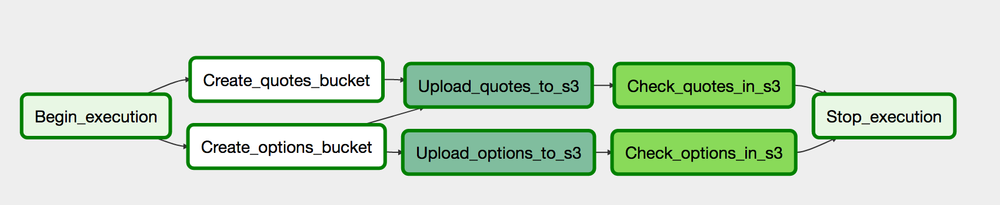
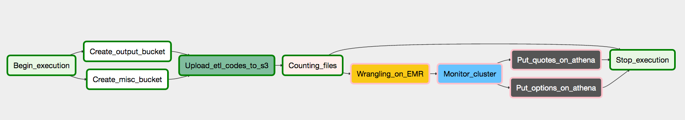
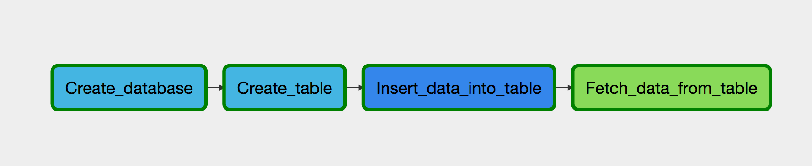

Build a Data Lake with Airflow and AWS
===========================

This project is part of the [Data Engineering Nanodegree](https://www.udacity.com/course/data-engineer-nanodegree--nd027) program, from Udacity. I manipulate historical bid/ask prices on Brazilian stocks and options to be used by other applications later. I used Airflow to automate the local data upload to S3 and an ETL pipeline to build and manage a data lake hosted on S3 and included a Flask app that uses [Dash](https://plotly.com/dash/) to show off how to consume such data.

The data pipelines implemented are dynamic and built from reusable tasks that can be monitored and allow smooth backfills. There are tests against the data uploaded and generated to catch any discrepancies in the S3 directories.

### Dataset and Pipelines

The source datasets consist of CSV files with snapshots of the market prices, options implied volatility, and other meta-informations, as strikes and expiration dates. The data are supposedly saved every 10 minutes. However, there are many missing files and discrepancies in the numbers saved. For example, prices sometimes are presented as “12.10” and other times as “12,10”. Or volumes that are shown as text, such as “10k12”, that is 10120.

This data is initially pushed to S3 and then pulled from to be processed using Spark, running in an EMR cluster, to split the data into two new tables, each one containing parts of the original data, with the ill-formatted numbers correctly transformed. These tables are loaded back to S3 as parquet files, partitioned by year, month and day.

Finally, the S3 directories created are mapped to Athena tables that can be queried using SQL by external applications. All these steps are orchestrated by Airflow, that uses two different DAGs and one sub-DAG to:

- Upload the data to S3;


- Wrangle the data and create tables to Quotes and Options using the sub-DAG;


- Create/update an Athena table (sub-DAG).


### Scalability

The dataset manipulated has more than 1,5 million rows distributed throughout hundreds of files. So, all the stack mentioned were chosen to be adequate to handle big data tasks and to make easy organize the complexities of the pipeline presented.

EMR clusters, where Spark is run, is easy to scale. The S3, where resides the data lake, and the Athena to query this data, are serverless, so they scale up and back as demanded. **If the data was increased by 100x**, we would just have to change the scripts configuration to increase our EMR cluster. If **the database needed to be accessed by 100+ people**, Athena would smoothly handle it.

Lastly, every step from the DAGs has some dependencies that have to run successfully before them. Airflow handles it efficiently, making debugging more manageable as it saves logs of each step, and shows precisely where the execution is or failed. It also makes the role of crontabs, where we can schedule the pipelines to run as we wish. We can make it run daily, weekly, even at a specific time of the day, **as running 7 am every day**.


### Install
To set up your python environment to run the code in this repository, start by
 creating a new environment with Anaconda and install the dependencies.

```shell
$ conda create --name ngym36 python=3.6
$ source activate ngym36
$ pip install -r requirements.txt
```

### Run
In a terminal or command window, navigate to the top-level project directory (that contains this README). You will use [Airflow](https://airflow.apache.org/) to orchestrate all the ETL processes to start an [EMR](https://aws.amazon.com/emr/) cluster to run Spark jobs to wrangle the data and save the results in [S3](https://aws.amazon.com/s3/) buckets and create [Athena](https://aws.amazon.com/athena/) tables to explore these buckets later. So, start by renaming the file `confs/dpipe.template.cfg` to  `confs/dpipe.cfg` and fill in the `ACCESS_KEY_ID` and `SECRET_ACCESS_KEY` in the AWS section. Then, run the following commands:

```shell
$ . scripts/download-data.sh
$ python iac.py -i
$ . setup-airflow.sh
$ python iac.py -a
$ . start-airflow.sh
```

The above instructions will download the sample data, create the IAM role, and set up your AIRFLOW_HOME to the current project's `airflow/` folder. **Some errors will show up, don't worry**. The fourth command sets the required variables and connections, as the AWS key. The last command starts the airflow UI.

Then, navigate to `http://localhost:3000` in your browser and turn on the `upload_raw_data` DAG. It will create required buckets in S3 and upload all data downloaded before. After complete this DAG, turn on  `create_datalake` to start the ETL process. You can click in the DAG name to follow the process execution steps. Finally, CLEAN UP your resources using and start a Dash app using the commands below:

```shell
$ . stop-ariflow.sh
$ python app.py
```

Using the app, you can check out a possible use to the data lake created or use the `athena-querying-local` jupyter notebook to see some examples of Athena API use.

There are some other commands to help explore EMR in `iac.py`, if you wish, as the flags `-e`, `-s` and `-d`, to help start an EMR cluster, check its status, and terminate it. Use `-h` to see the description of each one.


### Table Schemas

##### Quotes
- intdate: integer. Datetime in format YYYYMMDDHHmm.
- ticker: string. Name of the instrument. It can be an option or a stock ticker.
- last_close: float. Close price of the previous session.
- open: float. Open price of the current session.
- max: float. Maximum price traded in the current session.
- min: float. Minimum price traded in the current session.
- last: float. Maximum price traded in the current session.
- qty_bid: integer. Total quantity in the best bid price.
- bid: float. Best bid price.
- ask: float. Best ask price.
- qty_ask: integer. Total quantity in the best ask price.
- num_trades: float. Number of trades in the current session.
- qty_total: float. Total quantity traded in the current session.
- total_volume: float. Total volume traded in the current session.
- year: integer (partition). Year of the data.
- month: integer (partition). Month of the data.
- day: integer (partition). Day of the data.


##### Options  
- intdate: integer. Datetime in format YYYYMMDDHHmm.
- ticker : string. Option ticker.
- optn_ua: string. Option Underlying Asset.
- optn_style: string. Option Style.
- optn_tp: string. Option Type.
- optn_expn_days: integer. Day to expiration of the option
- optn_expn_date: string. Date of the expiration.
- optn_strike: float. Option Strike.
- optn_bs_delta: float. Option delta calculated with Black and Scholes.
- optn_mkt_bid: float. Option best bid price.
- optn_bs_bid: float. Option bid price calculated with BS.
- optn_mktbs_bid: float. Option best bid price or BS price, when price in unavailable.
- ua_mkt_bid: float. Underlying Asset best bid price.
- optn_mkt_ask: float. Option best ask price.
- optn_bs_ask: float. Option ask price calculated with BS.
- optn_mktbs_ask: float. Option best ask price or BS price.
- ua_mkt_ask: float. Underlying Asset best ask price.
- bid_volimp: float. Implied Volatility to bid.
- bid_volcone: float. Underlying Asset historical volatility to this maturity
- ask_volimp: float. Implied Volatility to ask.
- ask_volcone: float. Underlying Asset historical volatility to this maturity
- year: integer (partition). Year of the data.
- month: integer (partition). Month of the data.
- day: integer (partition). Day of the data.


### License
The contents of this repository are covered under the [MIT License](LICENSE).
